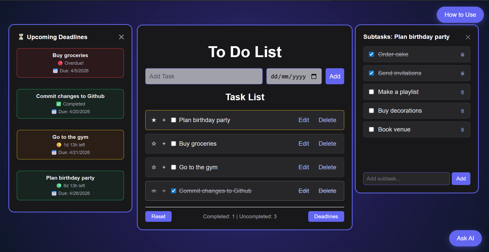

# 📝 To-Do List Web App

A smart and modern **To-Do List web application** built using **HTML, CSS, JavaScript, and Node.js**.  
This project allows users to manage their daily tasks efficiently with an intuitive UI, persistent storage, and an AI-powered assistant.

---

## 📸 Preview


---

## 🚀 Features

- ➕ Add new tasks (click button or press Enter)
- ✅ Mark tasks as completed
- ✏️ Edit existing tasks inline — change name and due date without a popup
- 🗑️ Delete tasks with confirmation prompt
- ⭐ Star/important tasks with yellow border highlight
- 📋 Add subtasks to any task and track them individually
- 📅 Set due dates with live countdown timers
- 🟢🟡🔴 Color-coded deadline urgency — plenty of time, under 3 days, overdue
- 💾 Tasks persist on page refresh using localStorage
- 📊 Real-time task counters (Completed / Uncompleted)
- 🔄 Reset button to clear all tasks
- 🎉 Displays a message when all tasks are completed
- ❓ Built-in How to Use guide
- 🤖 AI chatbot assistant powered by Groq (llama-3.3-70b)
  - Aware of your current tasks, subtasks, deadlines, and their status
  - Helps prioritize, plan, and break down tasks
  - Resizable chat window fixed to bottom right
- 🎨 Modern dark-themed UI with smooth styling

---

## 🛠️ Tech Stack

- **HTML** – Structure of the application
- **CSS** – Styling and layout (dark theme + responsive design)
- **JavaScript** – Functionality and interactivity
- **Node.js + Express** – Backend server for AI chatbot
- **Groq API** – AI model (llama-3.3-70b) for the chatbot
- **localStorage** – Persistent task storage

---

## ⚙️ Setup & Installation

1. Clone the repository
2. Run `npm install`
3. Get a free Groq API key at [console.groq.com](https://console.groq.com)
4. Open `server.js` and replace `YOUR_GROQ_API_KEY_HERE` with your actual key
5. Start the backend server: `node server.js`
6. Open `index.html` in your browser

```
> ⚠️ The AI chatbot requires the Node.js server to be running locally.
